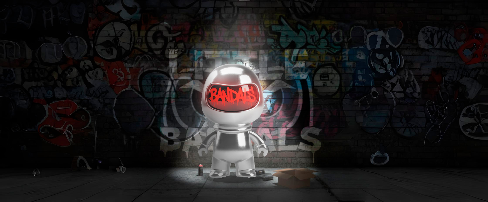

# Little Bandals - Urban Vinyl E-commerce 🎨🛒

Proyecto **Full Stack** de un E-commerce de figuras coleccionables, combinando diseño 3D propio con desarrollo web avanzado.

## 📄 Documentación Completa
> **[Ver Documentación Técnica (PDF)](WebLittleBandals_SergioGarcia/Web_completa_funcionalidad_SergioGarcia.pdf)** - *Análisis funcional, estructura de BBDD y validaciones.*

## 🚀 Características Técnicas

### Frontend 🖌️
* **HTML5/CSS3:** Diseño responsivo con **Grid/Flexbox**, variables CSS personalizadas y animaciones nativas (`@keyframes`).
* **JavaScript (Vanilla):** Lógica de cliente sin frameworks. Uso de **Async/Await** para peticiones AJAX y manipulación del DOM en tiempo real.
* **UI/UX:** Filtrado dinámico de productos y gestión de estado del carrito en el cliente.

### Backend ⚙️
* **PHP Nativo:** Arquitectura API REST para la comunicación asíncrona con el frontend.
* **Seguridad:** Implementación de **PDO** (Sentencias Preparadas) para prevenir inyección SQL y hashing de contraseñas (`password_hash`).
* **Base de Datos:** MySQL relacional gestionando Usuarios, Productos y Pedidos.

### WPO & SEO 🚀
* Estrategia de **palabras clave** y metaetiquetas **Open Graph** para redes sociales.
* Validación de estándares **W3C**.
* Optimización de assets gráficos (imágenes y renders 3D).

## 🛠️ Instalación Local

1. Clonar el repositorio.
2. Importar la base de datos (estructura disponible en la documentación).
3. Configurar la conexión en los archivos `/php`.
4. Ejecutar en servidor local (XAMPP/WAMP).

---
*Desarrollado por **Sergio García** - Técnico Superior en DAW & Animación 3D*
